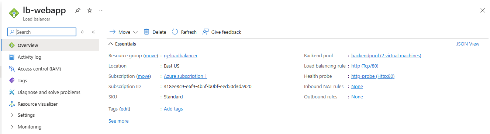

# Azure Load Balancer with NGINX Web VM(s)

This Terraform project deploys a public-facing Azure Load Balancer that distributes traffic to one or more Linux VMs running NGINX. Each VM is created in a virtual network subnet and managed through a load balancer backend pool.

## ✅ What This Project Does

- Creates a Resource Group and Virtual Network
- Deploys a Subnet, NSG, and Public IP for the Load Balancer
- Sets up an Azure Load Balancer with:
  - Frontend IP configuration
  - Backend pool
  - Health probe
  - Load balancing rule (port 80)
- Deploys 1 Linux VM with:
  - Network Interface (NIC)
  - NGINX installed via custom data
  - Association to backend pool

## 📂 Files

- `main.tf`: Terraform configuration for entire infrastructure
- `outputs.tf`: Displays the public IP address of the load balancer
- `.gitignore`: Prevents terraform state and local files from being tracked
- `terraform-lb-output.png`: Terminal screenshot showing output IP
- `azure-lb-vm-pool.png`: Azure portal screenshot showing VM backend pool

## 🖼️ Screenshots

  
*Shows result of `terraform apply`, including IP address*

  
*Azure Portal: Load Balancer backend pool view*

## 🌐 Test It

Visit the public IP in your browser to see the NGINX default page:

```
http://<load_balancer_public_ip>
```

Example from this deployment:
```
http://20.51.134.90
```

## 🧠 Interview-Style Questions

1. **Why use a Load Balancer instead of a single VM?**  
   To distribute traffic, ensure high availability, and allow horizontal scaling.

2. **How does the health probe help?**  
   It checks VM availability. If a VM is unhealthy, it’s removed from rotation.

3. **What does `custom_data` do in a VM?**  
   It’s a startup script that installs and configures software like NGINX.

4. **Can you increase the number of backend VMs easily?**  
   Yes. You just increase the `count` in the VM and NIC resources.

5. **What Terraform resource connects NICs to backend pools?**  
   `azurerm_network_interface_backend_address_pool_association`

---

🚀 Successfully deployed and tested via Terraform on Azure.
